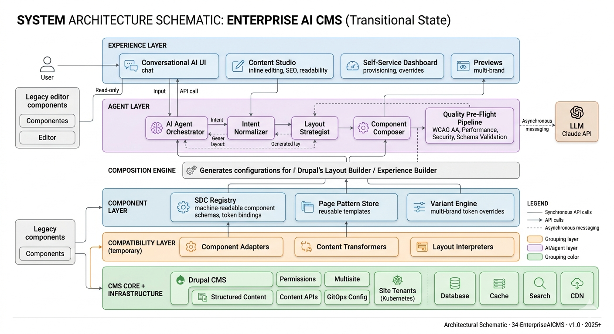

# 34 · Enterprise AI CMS

> **The Prompt-to-Publish Platform** — An AI-augmented, token-driven, component-first Drupal WebCM where any authorized editor can compose beautiful, WCAG AA–compliant, brand-coherent websites, and where the system structurally prevents the creation of anything insecure, inaccessible, or off-brand.


---

## Table of Contents

1. [Management Summary](#1-management-summary)
2. [High-Level Architecture](#2-high-level-architecture)
3. [Roadmap](#3-roadmap)
4. [SWOT Analysis](#4-swot-analysis)
5. [Target Group](#5-target-group)
6. [Repository Structure](#6-repository-structure)
7. [Documentation](#7-documentation)
8. [Getting Started](#8-getting-started)

---

## 1. Management Summary

### The Problem

Global enterprises running Drupal-based web platforms face a structural paradox. Centrally managed design systems deliver consistency but throttle creativity. Local site teams need flexibility to differentiate, yet unbounded freedom creates brand drift, accessibility debt, and security vulnerabilities — at scale, across hundreds of sites, with dozens of teams.

Meanwhile, AI design tools now produce extraordinary visual output — but outside the governed CMS, creating disconnected one-offs that bypass every quality gate.

**The enterprise loses on both sides:** too controlled for speed, too fragmented for quality.

### The Solution

**34-EnterpriseAICMS** resolves this paradox by redesigning the constraint surface. Instead of choosing between control and freedom, the platform makes AI-powered creativity *structurally impossible to express badly*.

The core idea:

> Every component is pre-built, pre-tested, WCAG AA–compliant, and security-audited. The AI knows this entire vocabulary and can only compose within it. Editors describe intent; the system assembles quality.

This produces three structural guarantees:

| Guarantee | Mechanism |
|-----------|-----------|
| **Quality by Construction** | Components are pre-validated. Editors assemble — they never build from scratch. |
| **AI as Constrained Composer** | AI generates layouts from the design system's vocabulary only. It cannot escape it. |
| **Governance Without Bureaucracy** | Rules are code, not committees. Approvals trigger only for out-of-envelope exceptions. |

### Business Impact

Once fully operational, the platform delivers:

| Metric | Current State | Target State |
|--------|--------------|-------------|
| New campaign page | Days to weeks | **< 2 hours** |
| New site provisioning | Weeks, requires dev team | **< 30 minutes, self-service** |
| WCAG AA compliance | Manual audit, inconsistent | **100%, structurally enforced** |
| Security patch latency | Varies per site | **< 24 hours, automated** |
| Brand design reviews | Required for most changes | **Near-zero (policy as code)** |
| Component reuse across sites | ~20–40% | **> 85%** |

A regional marketing team in Singapore launches a fully accessible, brand-compliant, high-performance campaign site in two days — without a developer, a design review, or a security audit — because the platform has already done all three, structurally.

---

## 2. High-Level Architecture



The platform is organized in five layers, each with a clear responsibility and a clean interface to the layers above and below.

```
┌─────────────────────────────────────────────────────────┐
│  LAYER 5 · EXPERIENCE                                   │
│  Conversational UI · Content Studio · Self-Service      │
└──────────────────────────┬──────────────────────────────┘
                           ↓
┌─────────────────────────────────────────────────────────┐
│  LAYER 4 · AI ORCHESTRATION                             │
│  Prompt→Layout Engine · Token Variator · Pre-Flight QA  │
└──────────────────────────┬──────────────────────────────┘
                           ↓
┌─────────────────────────────────────────────────────────┐
│  LAYER 3 · COMPONENT & PATTERN                          │
│  Drupal SDC Library · Machine-Readable Registry ·       │
│  Page Pattern Store · Variant Engine                    │
└──────────────────────────┬──────────────────────────────┘
                           ↓
┌─────────────────────────────────────────────────────────┐
│  LAYER 2 · DESIGN TOKENS                                │
│  Global · Semantic · Component · Multi-Brand Overlays   │
│  Figma Tokens → Style Dictionary → CSS → Drupal Theme   │
└──────────────────────────┬──────────────────────────────┘
                           ↓
┌─────────────────────────────────────────────────────────┐
│  LAYER 1 · FOUNDATION                                   │
│  Drupal 11 · GitOps Fleet · Security Baseline ·         │
│  CI/CD Quality Gates · Multi-Region CDN                 │
└─────────────────────────────────────────────────────────┘
```

### The AI Composition Loop

```
Editor types natural-language intent
        ↓
AI maps intent → component + token configurations
(using machine-readable component registry as system context)
        ↓
Pre-flight validation pipeline
(axe-core · Pa11y · contrast · CSP · Core Web Vitals)
        ↓
Only passing layouts surfaced to editor
        ↓
Editor refines via conversation ("swap hero", "make it darker")
        ↓
Human approves → automated deployment
```

### The Prompt-to-Publish Flow

| Step | Actor | Action |
|------|-------|--------|
| 1. Provision | Site team | Self-service GitOps deployment, < 30 min |
| 2. Prompt | Editor | Natural-language page description |
| 3. Compose | AI | Assembles layout from approved SDC components + brand tokens |
| 4. Refine | Editor + AI | Iterative chat-based adjustments within guardrails |
| 5. Validate | Automated pipeline | WCAG AA · security · performance · brand compliance |
| 6. Deploy | CI/CD | Passing page goes live across CDN, all regions |

For the full architecture specification, see [`architecture.md`](./architecture.md).

---

## 3. Roadmap

The platform transitions in three phases over 30 months, following a **Strangler Fig pattern** — new capabilities are built alongside the legacy system and proven before the legacy is decommissioned. No big-bang rewrite.

### Phase 1 · Foundation & Coexistence (Months 1–9)
*Solidify the design system. Introduce low-risk AI for content only.*

**Goal:** Stop design drift. Establish the canonical token system, migrate existing Drupal components to Single Directory Components (SDC), and deploy automated quality gates. AI is introduced for text, alt-text, and SEO metadata only — no layout generation yet.

Key deliverables:
- Design Token System (Figma ↔ code, versioned, all themes consuming it)
- Component Registry v1 (50+ SDC components, Storybook, a11y tested)
- CI/CD Quality Gates (WCAG AA + performance + security, blocking on failure)
- AI Content Copilot (text, SEO, alt-text in CKEditor)
- Governance Dashboard v1 (adoption, a11y, security per site)
- Security Baseline (CSP, RBAC, audit logs, automated patching)

---

### Phase 2 · AI Layout & Style Activation (Months 10–18)
*Editors describe pages. AI assembles them.*

**Goal:** Radically reduce the effort to build high-quality pages. Introduce the AI composition engine, connected directly to the component registry and token system from Phase 1. Site teams gain powerful new capabilities while operating within the validated envelope.

Key deliverables:
- AI Composition UI (conversational layout builder inside Drupal admin)
- Style Variant Engine (mood → token mapping within safe bounds)
- Component Registry v2 (100+ components with AI-discoverable metadata)
- Multi-Brand Tenancy (per-brand token overlays, AI is brand-context-aware)
- Content Intelligence (SEO, readability, inclusive language — all in-editor)
- Component Evolution Feedback Loop (editor gaps → quarterly backlog)

---

### Phase 3 · Global Self-Service & Autonomous Quality (Months 19–30)
*Business teams spawn sites via prompt. The platform governs itself.*

**Goal:** Make the platform the default for all enterprise web properties. Full global rollout, self-service site provisioning, proactive AI-driven quality management, and a living design standard with a community-driven evolution process.

Key deliverables:
- Self-Service Site Provisioning (new Drupal tenant live in < 30 min)
- Proactive Quality AI (continuous monitoring, auto-remediation PRs)
- AI-Driven A/B Testing (layout experiments within design system bounds)
- Federated Governance Model (central · regional · site-level autonomy)
- Component Registry v3 (200+ components, community contributions)
- Living Design Standard (RFC process, AI-assisted evaluation, global auto-deploy)

---

### Roadmap Summary

| Phase | Months | Focus | Key Metric |
|-------|--------|-------|-----------|
| 0 · Discovery | 0–2 | Audit, map, prioritize | Component inventory complete |
| 1 · Foundation | 1–9 | Tokens, SDC, quality gates, AI copilot | 50+ components, token system live |
| 2 · AI Activation | 10–18 | Conversational layout AI, style variants | > 70% editors using AI composition |
| 3 · Global Scale | 19–30 | Self-service, proactive AI, federated governance | > 90% component coverage, legacy retired |

For the full phased implementation plan, see [`implementationplan.md`](./implementationplan.md).

---

## 4. SWOT Analysis

### Strengths

**Structural quality enforcement** — Accessibility, security, and brand compliance are architecturally guaranteed, not manually reviewed. The system makes it impossible to publish inaccessible or off-brand content by design, not by process.

**AI-powered creativity within guardrails** — The platform enables unprecedented speed and visual variety without sacrificing governance. The constraint surface is redesigned, not removed.

**Drupal as a proven enterprise foundation** — Drupal 11 with SDC provides a mature, battle-tested CMS with strong multisite, permissions, and content modeling capabilities. The platform builds on an established ecosystem rather than re-inventing infrastructure.

**Scalable federated governance** — The three-tier operating model (central · regional · site) scales across hundreds of sites and dozens of brands without requiring a proportionally larger central team.

**Self-improving system** — The component evolution loop means the platform continuously closes the gap between editor needs and available capabilities. Technical debt is addressed systematically, not reactively.

**Token-driven design system** — A single versioned source of truth for all visual decisions means design changes propagate to all sites simultaneously, with no manual coordination.

### Weaknesses

**High initial investment** — Phase 1 alone requires significant effort (component audit, token architecture, SDC migration, CI/CD infrastructure) before editors see AI benefits. The business case depends on sustained commitment through a foundation phase with limited visible returns.

**Deep Drupal dependency** — The architecture is tightly coupled to Drupal. A future CMS change would require significant re-platforming. Teams with limited Drupal expertise face a steep onboarding curve.

**AI quality ceiling bounded by component library** — The AI can only compose what exists in the registry. If the component library is shallow, AI output will be repetitive and disappointing. Significant investment in component breadth is required to make the AI genuinely impressive.

**Change management complexity** — Migrating editors from manual layout building to conversational AI authoring is a significant cultural shift. Resistance from experienced Drupal editors accustomed to granular control is predictable and must be actively managed.

**LLM dependency and cost** — The composition engine depends on third-party LLM APIs (Claude, GPT-4o). Latency, cost, rate limits, and vendor changes are external risks outside the platform's control.

### Opportunities

**Enterprise market demand for AI-native CMS** — There is no dominant enterprise CMS solution that natively integrates AI composition with governance at this level. First-mover advantage in the enterprise Drupal space is significant.

**Accessibility legislation driving compliance urgency** — WCAG compliance is increasingly legally mandated (EU Accessibility Act, ADA). A platform where 100% compliance is structurally guaranteed is a compelling procurement argument.

**Expanding Drupal AI ecosystem** — The Drupal AI module, Experience Builder, and SDC are all maturing rapidly. The platform is positioned to leverage these investments as they become production-ready.

**Design operations as a product discipline** — The DesignOps function created by this platform (token management, component governance, RFC processes) can be formalized and monetized as a shared service across business units.

**Custom MCP server as a competitive moat** — The machine-readable component registry exposed as an MCP server creates a proprietary AI integration layer that competitors cannot easily replicate without the same design system investment.

**Cross-brand template marketplace** — Phase 3 community contributions and pattern stores create the foundation for an internal template marketplace, accelerating time-to-launch for new brands and campaigns.

### Threats

**LLM capability commoditization** — Competing CMS platforms (Contentful, Sanity, WordPress VIP) are actively integrating AI. The window for differentiation may be shorter than the 30-month roadmap.

**Legacy complexity underestimation** — Real enterprise Drupal installations often contain 10+ years of technical debt, undocumented customizations, and highly inconsistent content models. Migration effort routinely exceeds estimates by 2–3×.

**Editor adoption failure** — If the conversational AI does not consistently produce better results than manual layout building, adoption will stall and the platform will be perceived as over-engineered. Quality of the component library and LLM integration is critical.

**Organizational fragmentation** — The federated model requires sustained commitment from brand and regional teams who have competing priorities. Without executive sponsorship and a clear platform mandate, the central team becomes an island.

**Security surface expansion** — Introducing AI-generated content and automated PRs expands the attack surface. A compromised LLM prompt, a poisoned component suggestion, or an automated PR creating a dependency vulnerability are new threat vectors that require active mitigation.

**Regulatory AI uncertainty** — Emerging AI regulation (EU AI Act, sector-specific rules) may impose new requirements on AI-assisted publishing tools, particularly around transparency, human oversight, and content attribution.

---

## 5. Target Group

### Primary Users — The Platform Serves Three Distinct Audiences

#### 1. Enterprise Content Editors & Marketing Teams
*The daily drivers of the platform*

**Profile:** Non-technical marketers, campaign managers, and content strategists at global enterprises with 10–500+ web properties. They currently depend on developers for layout changes, wait days for design reviews, and discover accessibility issues after publishing.

**What they gain:** The ability to describe a page in natural language and receive a validated, brand-compliant, accessible layout in minutes. Creative control without technical gatekeeping. Confidence that what they publish meets every standard, without needing to know what those standards are.

**Pain solved:** Dependency on developer availability. Post-hoc accessibility surprises. Manual approval bottlenecks. Inability to experiment quickly.

---

#### 2. DesignOps & Platform Engineering Teams
*The builders and governors of the system*

**Profile:** Frontend developers, design system engineers, and DevOps engineers responsible for the web platform. They currently spend their time maintaining near-identical components across dozens of sites, firefighting design drift, and manually reviewing security posture.

**What they gain:** A single place to build components once and ship to all sites. Design governance enforced by code, not reviews. A component evolution loop that surfaces real editor needs. Automated security and accessibility compliance across the entire fleet.

**Pain solved:** Repetitive component re-implementation. Inconsistent quality across sites. Manual fleet management. Reactive security posture.

---

#### 3. Brand, Legal & Compliance Stakeholders
*The governance principals who set the standards*

**Profile:** Brand directors, accessibility leads, security officers, and legal/compliance teams. They currently rely on manual audits, periodic reviews, and tribal knowledge to enforce standards across a fragmented web estate.

**What they gain:** Standards encoded as platform rules, not documents. Automatic audit trails. Policy-as-code for GDPR, WCAG, and brand guidelines. Real-time compliance visibility via the Governance Cockpit.

**Pain solved:** Manual compliance audits. Inconsistent standard enforcement. Lack of visibility across the global web estate. Reactive response to accessibility and security incidents.

---

### Secondary Users

**Regional Platform Teams** — Brand-specific platform engineers who maintain token overlays and regional component variants. They benefit from a clear scope, an RFC process for upward contributions, and a self-service model that reduces dependency on the central team.

**Legal & Security Reviewers** — Teams who benefit from policy-as-code enforcement, automatic audit logs, and AI-generated remediation PRs that reduce manual review burden.

**UX Researchers & Analysts** — Teams who gain structured A/B testing infrastructure, editor behavior analytics, and performance data correlated with layout decisions.

---

### Target Organizations

The platform is built for organizations with the following characteristics:

- **Scale:** 20+ Drupal web properties, 3+ brands or regions
- **Maturity:** Existing Drupal investment (Drupal 7/9/10) with recognized technical debt
- **Governance need:** Compliance requirements (WCAG, GDPR, sector-specific regulations)
- **Team structure:** Federated web teams across geographies or business units
- **Ambition:** Active investment in AI-augmented workflows and modern engineering practices

**Ideal sectors:** Global manufacturing, financial services, healthcare, higher education, government, and large retail — any organization operating a global web estate with high compliance requirements and distributed content ownership.

---

## 6. Repository Structure

```
34-EnterpriseAICMS/
├── README.md                    ← You are here
├── architecture.md              ← Full system architecture
├── implementationplan.md        ← 30-month phased transition plan
├── agentic.md                   ← Agentic system specification
├── skills.md                    ← Skill library specification
│
├── apps/
│   ├── api/                     ← Orchestrator API
│   └── web/                     ← Preview UI (React)
│
├── packages/
│   ├── schemas/                 ← Zod schemas for layouts, intents, plans
│   ├── agents/                  ← Agent implementations
│   ├── skills/                  ← Skill implementations
│   ├── registry/                ← Component registry (JSON)
│   └── tokens/                  ← Design token definitions
│
├── data/
│   ├── patterns/                ← Saved page patterns
│   └── fixtures/                ← Test fixtures
│
├── docs/
│   ├── decisions/               ← Architecture Decision Records (ADRs)
│   └── runbooks/                ← Operational runbooks
│
└── infra/
    └── docker-compose.yml       ← Local development environment
```

---

## 7. Documentation

| Document | Description |
|----------|-------------|
| [`architecture.md`](./architecture.md) | Five-layer architecture, AI composition model, compatibility layer, federated governance, technology stack |
| [`implementationplan.md`](./implementationplan.md) | 30-month phased plan, migration strategy, risk register, first-90-days action plan |
| [`agentic.md`](./agentic.md) | Agentic system specification: agents, execution model, memory architecture, guardrails |
| [`skills.md`](./skills.md) | Skill library: cognitive, structural, component, quality, refinement, and learning skills |

---

## 8. Getting Started

### Prerequisites

- Node.js LTS (via `nvm`)
- Docker (for local Postgres)
- An OpenAI or Anthropic API key

### Quick Start (Vertical Slice MVP)

```bash
# Clone
git clone https://github.com/TWeb79/34-EnterpriseAICMS.git
cd 34-EnterpriseAICMS

# Install dependencies
npm install -g pnpm
pnpm install

# Environment
cp .env.example .env
# Add your OPENAI_API_KEY or ANTHROPIC_API_KEY to .env

# Start infrastructure
docker-compose -f infra/docker-compose.yml up -d

# Run the API
pnpm --filter api dev

# Run the preview UI
pnpm --filter web dev
```

### First Milestone

Within 1–2 days of setup you should be able to:

1. Enter a natural-language page description
2. Receive a validated layout JSON from the AI composition pipeline
3. Preview the rendered result in the UI

See [`implementationplan.md`](./implementationplan.md) §8 for the full first-90-days action plan.

---

## Core Architectural Principle

> The design system is not a style-guide PDF. It is a living, versioned, machine-readable contract between designers, developers, content authors, and AI — enforced at build time, render time, and publish time.

---

*Enterprise WebCM Architecture Concept · Drupal + AI-Augmented Design System · Confidential Strategic Blueprint · 2025+*
